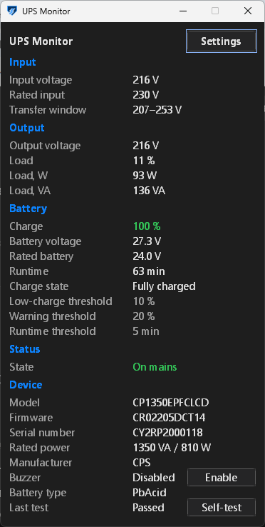

# ups-monitor

A Windows tray monitor for CyberPower UPS units, talking to the device
directly over USB HID. One executable, no installer, no service, no driver,
no registry, no network.

It was written for one machine and one UPS — a CyberPower CP1350EPFCLCD — as an
alternative to the vendor's own software. Everything here was tested on that
model and on no other. See [Hardware](#hardware).

## What it does

<p align="center">

</p>

- **Tray icon in four states**, first match wins: no contact with the device;
  critical — internal failure, overload, charge below the device's capacity
  limit, runtime limit expired, input voltage or frequency out of range;
  running on battery; normal. The mark is one shield-and-bolt drawing
  throughout; only the palette changes.
- **Status panel** with everything the device reports: state, model, firmware
  and serial, nameplate VA and watts, battery chemistry and manufacturer,
  input and output voltage, transfer window, load in percent, watts and VA,
  charge, battery voltage, estimated runtime, charge state, the device's
  capacity and runtime limits, and the standing fault flags.
- **Self-test on demand**, behind a confirmation dialog, with the result shown
  in the panel.
- **Beeper control** — the one setting the utility writes back to the UPS, and
  only on an explicit click.
- **Balloon notifications** for twelve events, each one switchable: power
  failure and restoration, low battery, runtime limit, voltage and frequency
  out of range, boost started and ended, device fault, overload, connection
  lost and restored.
- **A log beside the executable**, events only. A UPS sitting on mains for a
  week writes no lines at all.
- **24 interface languages**, compiled into the binary.
- **Two themes**, dark and light, switchable without a restart.

## What it deliberately does not do

These are architectural limits, not gaps waiting to be filled. The utility is
fully portable: it runs from a USB stick, and deleting its directory leaves
nothing behind.

| Not done | Why |
|---|---|
| Write or read the registry | Portability. No autostart entry, no AppUserModelID, no COM registration, no file associations |
| Touch any file outside its own directory | No `%APPDATA%`, no `%TEMP%`, no Start Menu shortcut |
| Read or change Windows power settings | The utility has no opinion about what your PC does when the battery runs down. Configure that yourself if you want it |
| Shut the machine down | Same reason. It reports; it does not act on your behalf |
| Open a socket | Ever, under any condition |
| Install a service or a scheduled task | Portability |
| Install or reconfigure a driver | Device enumeration is read-only |
| Use WinRT toast notifications | They need a registered AppUserModelID and a Start Menu shortcut. Balloons through the utility's own tray icon need neither |

The balloon route has costs, and they are accepted rather than worked around:
no buttons in the notification, no history in the Action Center, and a
63-character title with a 255-character body.

Autostart is not provided for the same reason. If you want it, put a shortcut
in your own Startup folder — that is your machine's configuration, not the
utility's.

## Hardware

Tested on a **CyberPower CP1350EPFCLCD** connected by USB, and on nothing else.

Other CyberPower units expose the same HID Power Device usages and may well
work; the vendor ASCII channel the self-test uses is a different matter and has
only ever been exercised against this one model. The USB IDs are configurable
(see [Configuration](#configuration)), so trying another unit costs nothing but
your time — but no claim is made here that it will work, because that has not
been measured.

The utility opens the HID interface with a zero access mask, so it does not
fight the system HID stack and does not stop anything else from reading the
device.

## Requirements

- 64-bit Windows. The DPI and per-monitor APIs used are present from Windows 10
  version 1703 onwards; **only Windows 11 was tested**.
- A CyberPower UPS on USB.
- Nothing else. There is no runtime to install: the binary links the system
  libraries and nothing more.

## Installation

Download `ups-monitor.exe` from the
[releases page](https://github.com/rustequal/ups-monitor/releases), put it
wherever you like, and run it. Check it against its published hash first if you
care to — see [Verifying the binary](#verifying-the-binary).

It starts in the tray. Right-click the icon for **Panel**, **Settings** and
**Exit**.

On first run it writes `ups-monitor.ini` beside itself. If the directory is not
writable — the utility sitting in `Program Files` without rights, say — the
panel shows a warning naming the file, and the utility carries on with its
settings in memory.

To uninstall, delete the executable and the two files beside it. There is
nothing else.

## Configuration

Settings are editable from the Settings window and stored in
`ups-monitor.ini`, next to the executable and named after it. The file is meant
to be hand-editable: unknown keys and comments survive a rewrite, and so do
your own spelling and spacing.

A value that cannot be read falls back to the default, is logged, and is
rewritten in the file — rather than being silently replaced or silently
kept.

| Section | Key | Values | Default |
|---|---|---|---|
| `general` | `language` | `en` `es` `pt` `ru` `de` `fr` `it` `pl` `tr` `uk` `nl` `cs` `sv` `el` `ro` `hu` `da` `fi` `no` `sk` `zh` `ja` `ko` `hi` | `en` |
| `general` | `poll_interval_ms` | 1000–60000, clamped into range | `3000` |
| `general` | `theme` | `dark` `light` | `dark` |
| `general` | `log_level` | `normal` `debug` | `normal` |
| `notifications` | `enabled` | `true` `false` | `true` |
| `notifications` | `on_power_failure` … `on_boost_ended` | `true` `false`, one key per event | `true` |
| `device` | `vendor_id` | hex, e.g. `0x0764` | `0x0764` |
| `device` | `product_id` | hex, e.g. `0x0601` | `0x0601` |
| `window` | `start_minimized` | `true` `false` | `true` |
| `window` | `panel_x`, `panel_y` | written by the utility to remember where the panel was | — |

The poll interval has a floor of one second and it is enforced regardless of
what the file says: these units stop answering under aggressive polling and
recover only when physically reconnected, so the floor is a device-safety
property rather than a politeness.

`log_level = debug` adds exactly one category — the reason a value could not be
read — and nothing else. It exists for one question: the panel shows a dash
where a number belongs, and `normal` says nothing about why.

## Languages

Twenty-four languages ship in the binary. There are no `lang/` or `themes/`
directories and nothing to place beside the executable: a missing or truncated
translation file is a failure mode that no longer has a way to happen, and a
forgotten string is a compile error rather than a blank label found by a user.

Twenty of the languages are set in Segoe UI. The four scripts it does not cover
use a system font that cannot be uninstalled from a desktop or server edition
of Windows: Microsoft YaHei UI for Chinese, Yu Gothic UI for Japanese, Malgun
Gothic for Korean, Nirmala UI for Hindi. Only the characters the interface font
cannot draw are set in the other face, so digits, units and model codes look
the same in every language.

The layout is required to hold strings twice as long as their English
originals, and tests hold translations to it: every label of the panel,
settings, states, flags and self-test is checked against a per-group budget,
and the one line that may never wrap — the settings interval warning — is
measured in pixels, in its own language's font, against the width that
language's window actually takes.

Adding a language means adding an entry to the table in
`src/strings/languages.rs`, raising `LANGUAGE_COUNT` beside `KEY_COUNT` in
`src/strings/mod.rs`, and rebuilding; a string left out is a compile error.
Pull requests welcome.

## How the device is read

Values come from HID feature reports through `HidD_GetFeature` and the
`HidP_*` parsing API, mapped from the standard HID Power Device usage page.
Reports are fetched whole and cached per poll rather than per field, which took
one pass from 28 USB control transfers down to 12.

The self-test is not standard. Writing the HID `Test` feature report on this
model either does nothing or starts an unbounded discharge. The stock software
uses a vendor ASCII channel layered on top of HID instead: a gate flag in
feature report 37, the command in output report 41, the acknowledgement in
input report 40. That protocol was reconstructed from USBPcap captures of the
vendor software and confirmed against the device; a separate dump tool,
`ups-dump`, referred to in a few comments, was used during that work and is not
part of this repository.

## Building from source

```
cargo build --release --target x86_64-pc-windows-msvc
```

The minimum supported Rust version is **1.82**, and it is checked by CI on
every push. That is not the same as the version the published binary is built
with, which is pinned exactly — see below. The two are separate on purpose and
should not be conflated.

There is no build dependency beyond the toolchain. The application icon is
drawn at build time from the same code that draws the tray icons at run time;
nothing is downloaded, and no image file is committed.

On a machine with the Windows SDK on `PATH`, `build.rs` hands the resource to
`rc.exe`. Without it, the build script writes the `.res` container itself so
the build still works — which means the two paths produce different bytes. Only
the first one produces the published binary.

CI runs, on every push: `cargo check` and `cargo clippy -D warnings` with and
without `--tests` on 1.82, stable, beta and nightly; the test suite as native
Windows processes; coverage; `cargo fmt --check`; a forced `dead_code`/`unused`
pass; `cargo doc`; a release cross-build for `x86_64-pc-windows-gnu`;
`cargo deny`; and a set of source checks the compiler cannot make — comment
width and language, no suppressed warnings, doc blocks attached to the item
below them, import grouping, no Win32 call inside a window-state borrow, and
the metric counts below.

## Verifying the binary

The released binary is built locally, on Windows, for
`x86_64-pc-windows-msvc`. It is not signed and there is no chain of trust on
offer. What is on offer is reproducibility: follow this recipe and you get the
same bytes, and if you do, you know what you are running. If you would rather
not take that on faith, build it yourself and use your own file.

1. `rustc` 1.97.0 (2d8144b78 2026-07-07)
2. MSVC 14.44.35207 and Windows SDK 10.0.26100.0, from a **Developer Command
   Prompt** — `rc.exe` must be on `PATH`, or the resource takes the other
   branch and the bytes differ. Pin the toolset explicitly:
   `vcvarsall.bat x64 -vcvars_ver=14.44.35207`
3. `set CARGO_HOME=C:\cargo` — the `windows` crate puts three absolute
   `panic!` paths into the binary, so the registry path has to be part of the
   recipe. Nothing else leaks: this crate's own sources appear only as
   relative paths
4. `cargo build --locked --release --target x86_64-pc-windows-msvc`, with
   `RUSTFLAGS` unset

`/Brepro` is not a step: it lives in `.cargo/config.toml` in this repository,
and a `RUSTFLAGS` variable in the environment would replace it rather than add
to it. Without it the linker stamps the link time into the COFF header and the
debug directory, and two clean rebuilds of identical sources differ in 24
bytes. With it, two clean rebuilds in different directories give one identical
file. `.text` and `.rdata` were byte-identical either way — code generation is
deterministic; the timestamps were the whole difference.

The build directory does not affect the result and is not part of the recipe.
The sources do, down to line numbers: panic locations carry them into the
binary, so an edit that only moves a comment changes the bytes. Build from the
source archive attached to the release you are checking.

| | |
|---|---|
| File | `ups-monitor.exe` |
| Size | 529 408 bytes |
| SHA-256 | published on the release page |

`SHA256SUMS.txt` is attached to each release beside the binary.

What this does **not** prove: nothing here attests that the published source is
what you think it is, beyond your own reading of it, and nothing attests to the
toolchain. A reproducible build tells you that this binary came from this
source through this toolchain. It says nothing about whether any of the three
deserves your trust.

## Metrics

Checked against the tree by CI on every push, so they cannot quietly go stale.
The two clippy counts are taken with Rust 1.82, the minimum supported version:
newer clippy releases report more, and a count that moved with Rust releases
rather than with this code would not be worth tracking.

| Metric | Value |
|---|---|
| Pedantic warnings | 133 |
| Indexing sites | 113 |
| Unsafe blocks | 198 + 1 |
| Test functions | 527 |

`clippy::pedantic` is enabled at `warn` with no exceptions listed and none
intended. The count is not a gate on its own, but CI fails if it stops
matching this table, so it goes down only when code is fixed and the table is
changed with it — a suppressed warning and an absent warning look identical in
a green build and mean opposite things. There is no `#[allow]` anywhere in `src/`, and
a CI step fails the build if one appears.

`indexing_slicing` is counted for a sharper reason: the release profile is
`panic = "abort"` and the window procedure is `extern "system"`, so an index
out of range is the end of the process — in a utility whose job is to keep
running when the power fails. The count is a ratchet: a new `a[i]` has to be
paid for by closing another.

Every `unsafe` block carries a `SAFETY:` justification, and the compiler
enforces that: `clippy::undocumented_unsafe_blocks` is `deny`. The single
`unsafe impl` is the one in that column.

Tests live in `#[cfg(test)]` modules beside the code they cover, which is why
they reach private items. No test code is in the release binary.

## Status

Feature-complete for its purpose and in daily use on the machine it was written
for. It is not under active development: bugs will be fixed, and pull requests
adding a language or support for another unit are welcome, but there is no
roadmap.

## Licence

MIT. See [LICENSE](LICENSE).

Not affiliated with, endorsed by, or connected to Cyber Power Systems, Inc.
"CyberPower" is their trademark and is used here only to say which hardware
this talks to; the icon is original for the same reason.
